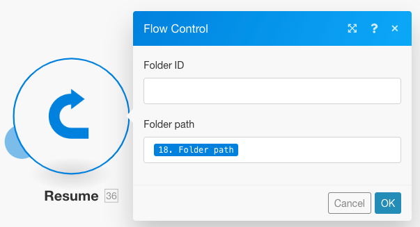

# Lägg till filtrering och kapsling i felhanteringsflöden

Du kan lägga till avancerade felhanteringstekniker i felhanteringsflödet genom att inkludera filtrering och kapsling.

## Åtkomstkrav

+++ Expandera om du vill visa åtkomstkrav för funktionerna i den här artikeln.

Du måste ha följande åtkomst för att kunna använda funktionerna i den här artikeln:

<table style="table-layout:auto">
 <col> 
 <col> 
 <tbody> 
  <tr> 
   <td role="rowheader">Adobe Workfront package 
   <td> 
Alla
 </td> 
  </tr> 
  <tr data-mc-conditions=""> 
   <td role="rowheader">Adobe Workfront-licens</td> 
   <td> 
Nytt: Standard

eller

Aktuell: Arbete eller högre
 </td> 
  </tr> 
  <tr> 
   <td role="rowheader">Adobe Workfront Fusion-licens**</td> 
   <td>
   
Aktuell: Inga Workfront Fusion-licenser krävs

   
eller

   
Äldre: Alla 

   </td> 
  </tr> 
  <tr> 
   <td role="rowheader">Produkt</td> 
   <td>
   
Nytt:
 <ul><li>Select or Prime Workfront Plan: Din organisation måste köpa Adobe Workfront Fusion.</li><li>Ultimate Workfront Plan: Workfront Fusion ingår.</li></ul>
   
eller

   
Aktuell: Din organisation måste köpa Adobe Workfront Fusion.

   </td> 
  </tr>
 </tbody> 
</table>

Mer information om informationen i den här tabellen finns i [Åtkomstkrav i dokumentationen](/help/workfront-fusion/references/licenses-and-roles/access-level-requirements-in-documentation.md).

Mer information om Adobe Workfront Fusion-licenser finns i [Adobe Workfront Fusion-licenser](/help/workfront-fusion/set-up-and-manage-workfront-fusion/licensing-operations-overview/license-automation-vs-integration.md).

+++

## Filtrering

Det finns två sorters filtrering som kan ske i en felhanterarväg.

* [Lägg till ett filter i felhanterarflödet](#add-a-filter-to-the-error-handler-route)
* [Lägg till en router följt av filter i felhanterarflödet](#add-a-router-followed-by-filters-to-the-error-handler)

### Lägg till ett filter i felhanterarflödet

Du kan använda ett filter för att kontrollera vilka fel som hanteras av felhanterarvägen. På så sätt kan du bara bearbeta vissa typer av fel. Om ett fel inte skickas genom filtret behandlas det som om ingen felhanterarväg har definierats för den angivna modulen.

Dessa filter konfigureras som andra filter i Fusion. Instruktioner finns i [Lägga till ett filter i ett scenario](/help/workfront-fusion/create-scenarios/add-modules/add-a-filter-to-a-scenario.md).

### Lägg till en router följt av filter i felhanteraren

Genom att lägga till en router i en felhanteringsväg kan du konfigurera olika vägar för olika typer av fel.

Om du till exempel vill konfigurera en väg att köras när felet är ett DataError-undantag, kan du ställa in ett filter som tillåter att data skickas genom om den mappade feltypen är lika med DataError.

Mer information om hur Fusion utvärderar och bearbetar olika datatyper finns i [Feltyper](/help/workfront-fusion/references/errors/error-processing.md).

### Exempel: Felhantering med filter

>[!BEGINSHADEBOX]

I det här exemplet visas hur dessa filter fungerar för felhantering.

Om du använder Dropbox > Skapa en mappmodul och det redan finns en mapp med samma namn, genereras ett DataError-fel i modulen:

Det fullständiga scenariot fungerar så här:

1. Verktyg > Ange variabel-modulen innehåller mappnamnet
1. HTTP > Hämta en filmodul hämtar filen som behöver överföras till mappen
1. Dropbox > Skapa en mappmodul genererar ett fel om det redan finns en mapp med samma namn som den som mappats i modulen
1. Felhanterarvägen (genomskinliga bubblor) innehåller en router som filtrerar felen
Den första vägen är för en angiven typ av fel med namnet `DataError`.

   1. Om en `DataError` inträffar och felinformationen skickas genom filtret visar Dropbox >Lista alla filer/undermappar i en mappmodul alla mappar i Dropbox.
   1. Det efterföljande filtret matchar mappnamnen.
   1. Direktivet **Återuppta** anger mapp-ID och mappsökväg för den befintliga mappen, och scenariokörningen återupptas från Dropbox > Skapa en mappmodul. I stället för att skapa en ny mapp använder Fusion värdena från direktivet Återuppta för att gå till nästa modul och överföra filen till den befintliga mappen.

1. Den andra vägen är för alla andra fel och slutar med direktivet Rollback, som gör att scenariot stoppas omedelbart

Nedan finns en detaljerad förklaring av DataError-flödet.

Om du vill använda den befintliga mappen i efterföljande moduler, till exempel Överför en fil, måste du lägga till en felhanterarväg till modulen och hämta mappsökvägen som ska mappas till modulen Återuppta direktiv enligt följande:

Filtret på den första vägen är inställt på att endast hantera det specifika felet (DataError) som visas när det redan finns en mapp med samma namn:

Dropbox > Lista alla filer i en mappmodul är konfigurerad att returnera alla mappar i målmappen. Följande filter skickar bara det som vi ursprungligen försökte skapa. (Mappnamnet sparas i mappen 33. Mappnamn.)

Direktivet Återuppta anger sedan mappsökvägen som utdata för den felaktiga modulen. Observera att mapp-ID:t har lämnats tomt eftersom det inte behövs av modulen Överför en fil.

>[!ENDSHADEBOX]

## Kapsling

Felhanterarvägar kan skapas och konfigureras på alla moduler, förutom routrar. Därför kan du skapa en felhanterarväg för en modul som redan är en del av en befintlig felhanterarväg.

>[!BEGINSHADEBOX]

Exempel:

En kapslad felhanterarväg med filter:

I det här scenariot kapslas den andra felhanterarvägen under den första felhanterarvägen.

Om ett fel uppstår i Dropbox > Skapa en mappmodul, flyttas körningen till den första vägen. Om filtret `DataError Takes Place` skickas körs nästa modul, följt av direktivet Återuppta om ett fel inte inträffar i Dropbox > Visa alla filer/undermappar i en mappmodul.

Om ett fel inträffar i Dropbox > Visa alla filer/undermappar i en mappmodul, flyttas körningen till Felhanterarflöde 2 och avslutas med direktivet [!UICONTROL Ignore]. Modulen [!UICONTROL Resume directive] körs inte i det här fallet.

>[!ENDSHADEBOX]
