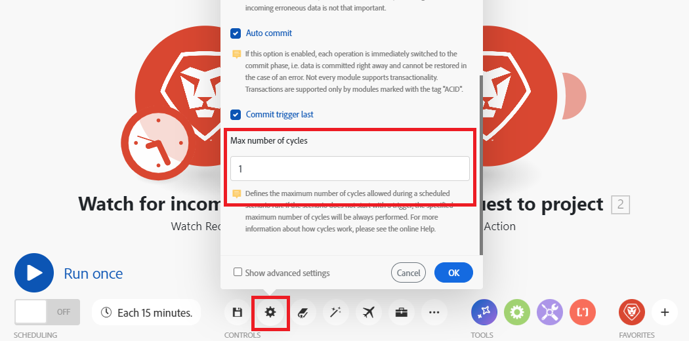

# Konfigurera scenarioinställningar

Du kan konfigurera specifika inställningar för scenarier på panelen för scenarioinställningar.

## Åtkomstkrav

+++ Expandera om du vill visa åtkomstkrav för funktionerna i den här artikeln.

Du måste ha följande åtkomst för att kunna använda funktionerna i den här artikeln:

<table style="table-layout:auto">
 <col> 
 <col> 
 <tbody> 
  <tr> 
   <td role="rowheader">Adobe Workfront</td> 
   <td> 
Alla
 </td> 
  </tr> 
  <tr data-mc-conditions=""> 
   <td role="rowheader">Adobe Workfront-licens</td> 
   <td> 
Nytt: Standard

eller

Aktuell: [!UICONTROL Work] eller högre
 </td> 
  </tr> 
  <tr> 
   <td role="rowheader">Adobe Workfront Fusion-licens**</td> 
   <td>
   
Aktuell: Inga Workfront Fusion-licenser krävs.

   
eller

   
Äldre: Alla 

   </td> 
  </tr> 
  <tr> 
   <td role="rowheader">Produkt</td> 
   <td>
   
Nytt:
 <ul><li>[!UICONTROL Select] eller [!UICONTROL Prime] Workfront-plan: Din organisation måste köpa Adobe Workfront Fusion.</li><li>[!UICONTROL Ultimate] Workfront-plan: Workfront Fusion ingår.</li></ul>
   
eller

   
Aktuell: Din organisation måste köpa Adobe Workfront Fusion.

   </td> 
  </tr>
  <tr data-mc-conditions=""> 
   <td role="rowheader">Konfigurationer på åtkomstnivå*</td> 
   <td> 
     
Du måste vara Workfront Fusion-administratör för din organisation.

     
Du måste vara Workfront Fusion-administratör för ditt team.

   </td> 
  </tr> 
   </td> 
  </tr> 
 </tbody> 
</table>

Mer information om informationen i den här tabellen finns i [Åtkomstkrav i Workfront-dokumentationen](/help/workfront-fusion/references/licenses-and-roles/access-level-requirements-in-documentation.md).

Mer information om Adobe Workfront Fusion-licenser finns i [Adobe Workfront Fusion-licenser](/help/workfront-fusion/set-up-and-manage-workfront-fusion/licensing-operations-overview/license-automation-vs-integration.md).

+++

## Öppna scenarioinställningarna

1. Klicka på **Scenarier** i den vänstra panelen.
1. Leta reda på det scenario du vill använda och klicka sedan på namnet.
1. Klicka var som helst i scenariot för att ange scenarioredigeraren.
1. Klicka på kugghjulsikonen i det nedre vänstra hörnet på sidan.

   

   På panelen [!UICONTROL Scenario settings] som visas kan du konfigurera olika avancerade inställningar för scenariot.
1. Aktivera eller inaktivera inställningarna för scenario efter behov. Se [Alternativ för scenarioinställningar](#scenario-settings-options) nedan.

## Alternativ för scenarioinställningar

### [!UICONTROL Sequential processing]

Det här alternativet tvingar alla körningar att ske i rätt ordning och är i första hand relevant för webhooks och ofullständiga körningar.

När sekventiell bearbetning är aktiverad inaktiveras parallella körningar av scenariot.

**Direktwebbhooks**: Om en webbkrokutlösare är konfigurerad som `instant` och sekventiell bearbetning är aktiverad, kommer alla direktanslutna webbkroknyttolaster att köas och bearbetas i den ordning de kommer fram. Detta kan vara användbart när händelser från externa system bearbetas i exakt ordning.

>[!NOTE]
>
>Bearbetningsfördröjningar sker automatiskt när varje nyttolast bearbetas innan nästa startas.

**Ofullständiga körningar**: Om Ofullständiga körningar också är aktiverat pausas scenariot om ett fel inträffar under körningen av ett scenario. Då händer något av följande:

* Om alternativet Sekventiell bearbetning är **aktiverat** avbryter Workfront Fusion bearbetningen av den befintliga sekvensen tills alla ofullständiga körningar har lösts.
* Om alternativet Sequential Processing är **inaktiverat** fortsätter scenariot att köras enligt schemat, tillsammans med upprepade försök att köra de ofullständiga körningarna igen.

  Mer information om ofullständiga körningar finns i [Visa och lösa ofullständiga körningar](/help/workfront-fusion/manage-scenarios/view-and-resolve-incomplete-executions.md).

  >[!NOTE]
  >
  >Sekventiell bearbetning kan orsaka en fördröjning i körningen av ett scenario. Om det fortfarande finns ofullständiga körningar i kön när en utlösare för ett instansscenario eller ett schemalagt scenario är inställt på att köras, kommer det scenariot att köras när alla körningar är slutförda innan det är klart.
  >
  >Om användningsfallet för dina scenarier inte kräver sekventiell bearbetning rekommenderar vi att du inaktiverar alternativet för sekventiell bearbetning.

  Mer information om schemaläggning finns i [Schemalägg ett scenario](/help/workfront-fusion/create-scenarios/config-scenarios-settings/schedule-a-scenario.md).

### Data är konfidentiella

När ett scenario har körts kan du som standard visa information om vilka data som har bearbetats av moduler i scenariot. Om du inte vill att den här informationen ska lagras aktiverar du alternativet [!UICONTROL Data is confidential].

>[!IMPORTANT]
>
>Om du aktiverar det här alternativet kan det vara svårt att lösa fel som kan uppstå när ett scenario körs.

### [!UICONTROL Allow storing incomplete executions]

Det här alternativet avgör hur Adobe Workfront Fusion fortskrider om ett fel inträffar under körningen av ett scenario. När det här alternativet är aktiverat pausas scenariot och flyttas till den ofullständiga körningsmappen. Detta ger dig möjlighet att åtgärda problemet och fortsätta att köra från där scenariot stoppades. Om det här alternativet är inaktiverat stoppas scenariot och en återställningsfas startas.

Mer information om ofullständiga körningar finns i [Visa och lösa ofullständiga körningar](/help/workfront-fusion/manage-scenarios/view-and-resolve-incomplete-executions.md).

### Aktivera dataförlust

Det här alternativet har att göra med aktivering av dataförlust om Workfront Fusion inte kan spara ett paket i kön med ofullständiga körningar (till exempel på grund av brist på ledigt utrymme). När det här alternativet är aktiverat går data förlorade för att förhindra avbrott i den övergripande scenariokörningen. Detta är användbart för scenarier där högsta prioritet är kontinuerlig körning och inkommande felaktiga data inte är så viktiga.

När ett scenario körs kan en modul ibland stöta på en fil som är större än den tillåtna maxstorleken. I det här fallet fortsätter Workfront Fusion i enlighet med inställningen för alternativet [!UICONTROL Enable data loss] och ett varningsmeddelande visas.

Mer information om ofullständiga körningar finns i [Visa och lösa ofullständiga körningar](/help/workfront-fusion/manage-scenarios/view-and-resolve-incomplete-executions.md).

Mer information om maximal filstorlek finns i [Skyddsutkast för Fusion-prestanda](/help/workfront-fusion/references/scenarios/fusion-performance-guardrails.md#files).

Mer information om varningar finns i [Feltyper](/help/workfront-fusion/references/errors/error-processing.md).

### [!UICONTROL Auto commit]

Inställningarna [!UICONTROL Auto commit] gäller för transaktioner och definierar hur ett scenario ska bearbetas. Om alternativet för automatisk implementering är aktiverat startar implementeringsfasen för varje modul omedelbart efter att operationsfasen har slutförts. När alternativet Automatisk implementering är inaktiverat utförs ingen implementering förrän åtgärderna körs för alla moduler (det här är standardläget).

### Maximalt antal cykler

>[!NOTE]
>
>Du måste aktivera kryssrutan **Visa avancerade inställningar** för att kunna se det här alternativet.

Det kan vara praktiskt att ange fler cykler när du vill förhindra avbrott i anslutningen till en tredjepartstjänst och försäkra dig om att alla poster behandlas i en enda scenario.

* Om scenariot börjar med en avsökningsutlösare definierar inställningen det maximala antalet cykler som tillåts under scenariokörningen.

  Mer information om avsökningsutlösare finns i [Avsökningsutlösare](/help/workfront-fusion/get-started-with-fusion/understand-fusion/module-overview.md#polling-triggers) i artikelmodulöversikten.

* Om scenariot börjar med en direktutlösare ignoreras inställningen och alla väntande händelser bearbetas under en enda körning, en händelse per cykel.

  Mer information om snabbutlösare finns i [Direktutlösare](/help/workfront-fusion/get-started-with-fusion/understand-fusion/module-overview.md#instant-triggers) i artikelmodulöversikten.

* Om scenariot inte börjar med en utlösare (direkt/avsökning) utförs alltid det angivna maximala antalet cykler.

>[!BEGINSHADEBOX]

**Exempel:** Workfront > [!UICONTROL Watch record] söker efter nya problem som kommer in, och Workfront >[!UICONTROL Convert object] konverterar den nya begäran till ett projekt och tilldelar den lämplig mall.

En [!UICONTROL more cycles]-inställning används bara när du schemalägger din scenariokörning. När du använder knappen [!UICONTROL Run once] beaktas cykelinställningarna.

#### Maximalt antal cykler är 1 (standard)

Maximalt antal cykler i modulen Workfront > Bevakade poster är `10`.
Om 100 begäranden skickas till Workfront och fältet Max antal cykler är inställt på 10, lämnas 90 filer obearbetade efter en scenariokörning. De nästa 10 filerna bearbetas i nästa körning av schemalagda scenario.

#### Högsta antal cykler är 10

Maximalt antal cykler i modulen Workfront > Bevakade poster är `10`.

Om 100 filer läggs till i Dropbox-mappen och alternativet Max antal cykler är inställt på 10, bearbetas 10 filer under den första cykeln, nästa 10 filer i den andra cykeln, nästa 10 filer i den tredje cykeln och så vidare, tills alla filer har bearbetats.

Alla filer bearbetas inom 1 scenariokörning.

Du kan se de cykler som redan körs i scenarioinformationen:

Mer information om den här sidan finns i [Scenarioinformation](/help/workfront-fusion/get-started-with-fusion/navigate-fusion/scenario-details.md).

>[!ENDSHADEBOX]

### Antal efterföljande fel

Definierar det maximala antalet efterföljande körningsförsök innan körningen av ett scenario inaktiveras (exklusive `DataError`, `DuplicateDataError`, `ModuleTimeoutError` och `ConnectionError`).

Mer information om fel finns i [Feltyper](/help/workfront-fusion/references/errors/error-processing.md).

>[!NOTE]
>
>Om ett scenario börjar med en direktutlösare ignoreras inställningen och scenariot inaktiveras omedelbart när det första felet har inträffat.

### Arbetarpool

>[!NOTE]
>
>Den här inställningen är bara synlig om följande två villkor uppfylls:
>
>* Du är organisationsadministratör eller ägare
>* Mer än en arbetarpool är kopplad till din organisation.

Den här inställningen tilldelar scenariot till en specifik arbetarpool som är kopplad till din organisation, så att du kan tilldela resurser till högprioriterade scenarier.
