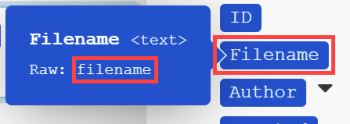

# Mappa en array eller ett arrayelement

En array är ett paketobjekt som kan innehålla följande:

* Ett eller flera värden av samma typ (enkel array)
* En eller flera samlingar av samma typ (komplex array)

>[!BEGINSHADEBOX]

**Exempel:**

* **Komplex array**: Modulen [!UICONTROL Watch emails] returnerar en array med bilagor för varje e-post. Alla bilagor representerar en samling som kan innehålla namn, innehåll, storlek och så vidare.

>[!ENDSHADEBOX]

## Åtkomstkrav

+++ Expandera om du vill visa åtkomstkrav för funktionerna i den här artikeln.

Du måste ha följande åtkomst för att kunna använda funktionerna i den här artikeln:

<table style="table-layout:auto">
 <col> 
 <col> 
 <tbody> 
  <tr> 
   <td role="rowheader">[!DNL Adobe Workfront] package</td> 
   <td> 
Alla
 </td> 
  </tr> 
  <tr data-mc-conditions=""> 
   <td role="rowheader">[!DNL Adobe Workfront] licens</td> 
   <td> 
Nytt: [!UICONTROL Standard]

eller

Aktuell: [!UICONTROL Work] eller högre
 </td> 
  </tr> 
  <tr> 
   <td role="rowheader">[!DNL Adobe Workfront Fusion] licens**</td> 
   <td>
   
Aktuell: Inga [!DNL Workfront Fusion]-licenskrav.

   
eller

   
Äldre: Alla 

   </td> 
  </tr> 
  <tr> 
   <td role="rowheader">Produkt</td> 
   <td>
   
Nytt:
 <ul><li>[!UICONTROL Select] eller [!UICONTROL Prime] [!DNL Workfront]: Din organisation måste köpa [!DNL Adobe Workfront Fusion].</li><li>[!UICONTROL Ultimate] [!DNL Workfront] plan: [!DNL Workfront Fusion] ingår.</li></ul>
   
eller

   
Aktuell: Din organisation måste köpa [!DNL Adobe Workfront Fusion].

   </td> 
  </tr>
 </tbody> 
</table>

Mer information om informationen i den här tabellen finns i [Åtkomstkrav i dokumentationen](/help/workfront-fusion/references/licenses-and-roles/access-level-requirements-in-documentation.md).

Mer information om [!DNL Adobe Workfront Fusion] licenser finns i [[!DNL Adobe Workfront Fusion] licenser](/help/workfront-fusion/set-up-and-manage-workfront-fusion/licensing-operations-overview/license-automation-vs-integration.md).

+++

## Mappa en hel array

1. Klicka på fliken **[!UICONTROL Scenarios]** i den vänstra panelen.
1. Välj det scenario där du vill mappa en array.
1. Klicka någonstans i scenariot för att öppna Scenarioredigeraren.
1. I modulen som du vill mappa arrayen till klickar du på fältet där du vill mappa arrayen. Det här är fältet som arrayen mappas till.

1. Mappa objektet i rutan som visas.

   På panelen kan du mappa fält på samma sätt som andra typer av objekt. Om du inte vill fylla i varje objekt separat, men vill mappa en annan array till målfältet, använder du knappen [!UICONTROL Map]. I det här fallet måste du se till att båda arrayerna (källarrayen och målarrayen) har samma struktur.

   Du kan lägga till valfritt antal objekt i en array.

Du kan dela upp en array i enskilda paket med hjälp av en iterator. Mer information finns i modulen [[!UICONTROL Iterator] i  [!DNL Adobe Workfront Fusion]](/help/workfront-fusion/references/modules/iterator-module.md).

## Mappa objekt till en ny array

I vissa fält i Workfront Fusion kan du mappa element till en array. Du kan t.ex. skapa en array med checklisteobjekt i modulen Workfront Boards > Lägg till checklisteobjekt. När modulen körs läggs alla objekt i checklistan till på kortet.

Alla modulfält som visar&quot;Lägg till objekt&quot; skapar en array.

Så här lägger du till element i arrayen:

1. Klicka på **Lägg till objekt**
1. Ange information om objektet på panelen som öppnas.
1. Klicka på **Lägg till**.
1. (Valfritt) Upprepa steg 1-3 för varje element som du vill lägga till i -arrayen.

## Mappa arrayelement

### Mappa arrayelement efter nummer

Arrayelement visas som ett tal inom hakparenteser efter arraynamnet. Du kan mappa ett enskilt element i en array till ett fält genom att använda detta indexnummer.

>[!NOTE]
>
>Matrisindexeringen i Workfront Fusion börjar från 1.

Så här mappar du ett arrayelement:

1. Klicka i det fält där du vill mappa elementet.

   Mappningspanelen öppnas.

1. Leta reda på arrayen som innehåller elementet som du vill mappa.
1. Klicka på pilen bredvid arrayen.
1. Klicka på elementet som du vill mappa.

   Elementet mappas med indexvärdet 1. Detta mappar det första elementet i arrayen.

1. Om du vill mappa ett annat element i arrayen klickar du på [1] och anger indexnumret för det arrayelement som du vill mappa.

   

### Mappa ett arrayelement med en given nyckel

Vissa arrayer innehåller samlingar med nyckelvärdesobjekt som metadata, attribut och så vidare. Om du vill använda något av dessa värden kan du slå upp ett element med dess angivna nyckelvärde och hämta motsvarande värde från värdeobjektet. Vi rekommenderar att du använder en formel som innehåller en kombination av funktionerna `map()` och `get()`.

>[!BEGINSHADEBOX]

I följande exempel visas utdata för appen [!DNL Jira].

I det här exemplet hämtas ett filnamn från en array med bilagor, för den specifika bilagan med ID 10108.

I det här exemplet genereras följande utdata:

Formeln kan förklaras på följande sätt:

* `map`

   1. Den första parametern i funktionen `map()` är hela arrayobjektet.
   1. Den andra parametern är värdobjektets raw-namn. Håll markören över objektet på panelen [!UICONTROL mapping] om du vill få Raw-namnet:

      

      >[!NOTE]
      >
      >Alla parametrar är versalkänsliga. Även om objektets etikett i det här exemplet skiljer sig från dess Raw-namn endast med versaler, måste du använda raw-namnet.

   1. Den tredje parametern är nyckelobjektets raw-namn:

      

   1. Den fjärde parametern är det angivna nyckelvärdet.

  Eftersom funktionen `map()` returnerar en array (eftersom det kan finnas fler element med det angivna nyckelvärdet), måste du använda funktionen `get()` för att få det första elementet:

* `get`

   1. Den första parametern i funktionen `get()` är resultatet av funktionen `map()`.

   1. Den andra parametern är elementets index. I det här exemplet är indexvärdet `1`.

I det här exemplet genereras följande utdata:

>[!ENDSHADEBOX]

Mer information om funktionen `map()` finns i [Array-funktioner](/help/workfront-fusion/references/mapping-panel/functions/array-functions.md).

Mer information om funktionen `get()` finns i [Allmänna funktioner](/help/workfront-fusion/references/mapping-panel/functions/general-functions.md).

## Konvertera arrayelement till en serie paket

Matriser kan konverteras till en serie paket med modulen [!UICONTROL Iterator]. Mer information finns i [[!UICONTROL Iterator] modul](/help/workfront-fusion/references/modules/iterator-module.md).

