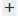

# Arbetsflöde för att skapa ett scenario

Scenarier har tagits fram för att uppfylla organisationens behov, med program och moduler som hanterar dina användningsfall. När du skapar ett scenario följer dock samma grundläggande arbetsflöde oavsett användningsfall. I den här artikeln beskrivs den grundläggande processen att skapa ett scenario.

* [Skapa och namnge scenariot](#create-and-name-the-scenario)
* [Lägg till och konfigurera den första modulen](#configure-the-first-module)
* [Skapa anslutningar](#create-connections)
* [Lägga till och konfigurera ytterligare moduler](#add-and-configure-additional-modules)
* [Mappa data mellan moduler](#map-data-between-modules)
* [Konfigurera routning](#configure-routing)
* [Konfigurera felhantering](#configure-error-handling)
* [Konfigurera scenarioinställningar](#onfigure-scenario-settings)
* [Testa och revidera](#test-and-revise)
* [Aktivera scenariot](#activate-the-scenario)

Kortkommandon

## Skapa och namnge scenariot

1. Logga in på ditt [!DNL Workfront Fusion]-konto.
1. Klicka på **[!UICONTROL Scenarios]**  i den vänstra panelen.

   >[!NOTE]
   >
   >Om den vänstra navigeringspanelen eller dess ikoner inte visas klickar du på ikonen  .

1. (Valfritt) Klicka på ikonen **[!UICONTROL Add folder]**  på panelen [!UICONTROL **Mappar**] och skriv sedan ett namn som &quot;Practice scenarios&quot; för den första mappen.

1. (Valfritt) Öppna mappen och klicka sedan på **[!UICONTROL Create a new scenario]** i det övre högra hörnet på sidan.

1. Markera platshållarnamnet **[!UICONTROL New scenario]** i det övre vänstra hörnet och skriv sedan ett namn som &quot;Practice scenarios 1&quot;.

   

1. Fortsätt med [Anslut den första modulen](#2-connect-the-first-module) nedan.

## Lägg till och konfigurera den första modulen

Den första modulen i ditt scenario är en utlösarmodul som startar scenariot när vissa villkor uppfylls.

Instruktioner om hur du lägger till den första modulen i ett scenario finns i [Lägg till den första modulen i ett scenario](/help/workfront-fusion/create-scenarios/add-modules/add-a-module-basic.md#add-the-first-module-to-a-scenario) i artikeln Lägga till en modul i ett scenario.

Instruktioner om hur du konfigurerar en modul finns i [Konfigurera en modul](/help/workfront-fusion/create-scenarios/add-modules/configure-a-modules-settings.md)

## Skapa anslutningar

När du konfigurerar en modul måste du ange eller skapa en anslutning. Modulen använder den här anslutningen och de behörigheter den innehåller för att få åtkomst till datumet i programmet.

Grundläggande instruktioner om hur du skapar en anslutning finns i [Skapa en anslutning - Grundläggande instruktioner](/help/workfront-fusion/create-scenarios/connect-to-apps/connect-to-fusion-general.md).

Specifika användningsfall som rör Google, Microsoft eller program utan dedikerade anslutningar finns i de andra artiklarna under [Ansluta till program: artikelindex](/help/workfront-fusion/create-scenarios/connect-to-apps/connect-to-apps-toc.md).

## Lägga till och konfigurera ytterligare moduler

Fortsätt lägga till och konfigurera ytterligare moduler.

Instruktioner om hur du lägger till moduler finns i artiklarna under [Lägg till moduler: artikelindex](/help/workfront-fusion/create-scenarios/add-modules/add-modules-toc.md).

## Mappa data mellan moduler

Du kan använda utdata från tidigare moduler som indata i efterföljande moduler. Du kan till exempel skapa ett Workfront-projekt i en modul och överföra ett dokument till den modulen i en efterföljande modul.

Instruktioner finns i artiklarna under [Kartdata: artikelindex](/help/workfront-fusion/create-scenarios/map-data/map-data-toc.md).

## Konfigurera routning

Routning gör att scenariot kan utföra olika åtgärder baserat på datavärden.

Instruktioner finns i [Lägga till en routermodul och konfigurera vägar](/help/workfront-fusion/create-scenarios/add-modules/router-module.md).

## Konfigurera felhantering

Felhantering gör att scenariot kan återställas från fel. Du kan välja hur du vill att scenariot ska reagera i olika felsituationer.

Instruktioner finns i [Lägg till felhantering](/help/workfront-fusion/create-scenarios/config-error-handling/error-handling.md).

## Konfigurera scenarioinställningar

Du kan konfigurera inställningar för scenariot som helhet, till exempel schemaläggning av ett scenario, anteckningar eller fastställande av hur data lagras.

Instruktioner finns i artiklarna under [Konfigurera scenarioinställningar: artikelindex](/help/workfront-fusion/create-scenarios/config-scenarios-settings/config-scenario-settings-toc.md).

## Testa och revidera

Genom att testa ditt scenario kan du avgöra om ditt scenario fungerar som det ska. Du kan sedan ändra scenariot baserat på dina resultat och sedan göra om testet.

1. Klicka på **[!UICONTROL Run once]** i det nedre vänstra hörnet i scenarioredigeraren.
1. När scenariot är klart klickar du på exekveringsinspektören ovanför varje modul för att visa indata och utdata för den modulen.

   * Allmän information om att läsa information om körning av scenarier finns i [Körningsflöde för scenarier](/help/workfront-fusion/references/scenarios/scenario-execution-flow.md).
   * Mer information om bearbetade paket finns i [Scenariokörning, cykler och faser i [!DNL Adobe Workfront Fusion]](/help/workfront-fusion/references/scenarios/scenario-execution-cycles-phases.md).

1. I [!DNL Workfront Fusion] klickar du på **[!UICONTROL Save]**  i det nedre vänstra hörnet för att spara förloppet för scenariot.

   >[!IMPORTANT]
   >
   >Spara ofta när du finslipar ett scenario.

## Aktivera scenariot

Det här exempelscenariot har ingen utlösarmodul. Om detta vore ett scenario som du skulle använda för riktiga data skulle det börja med en utlösarmodul, och det sista du skulle göra är att aktivera den. När du har aktiverat ett scenario körs det som standard var 15:e minut. Du kan ändra detta genom att definiera när och hur ofta du vill att det ska köras.

Mer information om att aktivera scenarier finns i [Aktivera eller inaktivera ett scenario](/help/workfront-fusion/manage-scenarios/activate-deactivate-scenarios.md).

Mer information om scheman finns i [Schemalägg ett scenario](/help/workfront-fusion/create-scenarios/config-scenarios-settings/schedule-a-scenario.md).

## Kortkommandon för Workfront Fusion-scenarier

Du kan använda följande kortkommandon när du skapar eller redigerar ett scenario:

<table style="table-layout:auto"> 
 <col data-mc-conditions=""> 
 <col data-mc-conditions=""> 
 <col data-mc-conditions=""> 
 <thead> 
  <tr> 
   <th> 
Åtgärd
 </th> 
   <th>[!DNL Windows]</th> 
   <th> 
[!DNL MacOS]
 </th> 
  </tr> 
 </thead> 
 <tbody> 
  <tr> 
   <td role="rowheader">[!UICONTROL Save] </td> 
   <td>Ctrl+Skift+S</td> 
   <td>Cmd+Skift+S </td> 
  </tr> 
  <tr> 
   <td role="rowheader">[!UICONTROL Run Once]</td> 
   <td>Ctrl+Skift+Retur</td> 
   <td>Cmd+Skift+Retur </td> 
  </tr> 
 </tbody> 
</table>

