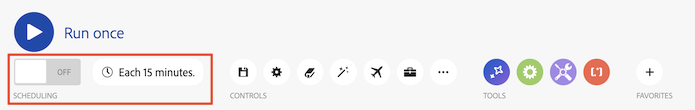

# Scenarieredigeraren

Med scenarioredigeraren kan du skapa och redigera scenarier i ett visuellt gränssnitt.

## Åtkomstkrav

+++ Expandera om du vill visa åtkomstkrav för funktionerna i den här artikeln.

<table style="table-layout:auto">
 <col> 
 <col> 
 <tbody> 
  <tr> 
   <td role="rowheader">Adobe Workfront package</td> 
   <td> 
Alla Adobe Workfront Workflow-paket och alla Adobe Workfront Automation and Integration-paket

Workfront Ultimate

Workfront Prime- och Select-paket med ytterligare köp av Workfront Fusion.
 </td> 
  </tr> 
  <tr data-mc-conditions=""> 
   <td role="rowheader">Adobe Workfront-licenser</td> 
   <td> 
Standard

Arbeta eller högre
 </td> 
  </tr> 
  <tr> 
   <td role="rowheader">Produkt</td> 
   <td>
   
Om ni har ett Select- eller Prime Workfront-paket som inte innehåller Workfront Automation and Integration måste ni köpa Adobe Workfront Fusion.</li></ul>
   </td> 
  </tr>
 </tbody> 
</table>

Mer information om informationen i den här tabellen finns i [Åtkomstkrav i dokumentationen](/help/workfront-fusion/references/licenses-and-roles/access-level-requirements-in-documentation.md).

+++

## Öppna scenarioredigeraren och lägg till en modul:

1. Klicka på **[!UICONTROL Scenarios]**  i den vänstra panelen.
1. Klicka på frågetecknet  och sök efter och klicka sedan på det program eller den tjänst som du vill börja med. Mer information om hur du konfigurerar en modul finns i [Konfigurera en modul](/help/workfront-fusion/create-scenarios/add-modules/configure-a-modules-settings.md).

## Tillgängliga scenarioredigeringsåtgärder

### Kör ditt scenario

| Åtgärd | Information |
|----------|----------|
| Testkör scenariot | Kontrollera att scenariot fungerar som du tänkt dig innan du aktiverar det. När det är aktiverat körs scenariot enligt dess schema. Om allt inte fungerar som det ska läser du [Lägg till felhantering](/help/workfront-fusion/create-scenarios/config-error-handling/error-handling.md) för att lära dig hur du hanterar fel. |

### Schemaläggning

| Åtgärd | Information |
|----------|----------|
| Schemalägg scenariot | Som standard körs ett scenario var 15:e minut. Du kan ändra detta genom att definiera när och hur ofta ett aktiverat scenario körs. Fusionsscenarier kan schemaläggas så att de körs så ofta som var femte minut. Mer information finns i [Schemalägg ett scenario](/help/workfront-fusion/create-scenarios/config-scenarios-settings/schedule-a-scenario.md). |

### Kontroller

Du kan behöva klicka på ikonen med tre punkter i området Kontroller för att visa några av dessa kontroller.

| Åtgärd | Information |
|----------|----------|
| Spara 

 | När du har sparat ditt scenario kommer en ny version att finnas tillgänglig under menyn med tre punkter om du behöver komma åt den i framtiden. Tidigare sparade versioner är endast tillgängliga i 60 dagar. |
| Scenarioinställningar 

 | Panelen för scenarioinställningar innehåller avancerade inställningar för scenariot. Mer information om tillgängliga inställningar finns i [Konfigurera scenarioinställningar](/help/workfront-fusion/create-scenarios/config-scenarios-settings/configure-scenario-settings.md). |
| Anteckningar  

 | Gör anteckningar om scenariot. Andra användare kan visa dessa anteckningar när de befinner sig i ett scenario. |
| Autojustera 

 | Justera modulerna automatiskt i ditt scenario. |
| Sökmoduler   
 | Ange en sökterm för att söka efter en modul och klicka sedan på sökresultaten som ska hämtas till den modulen. Du kan söka efter modulnamn, ID, typ eller program. |
| Förklara flöde  
 
 | Visa en animering där rörliga punkter visar hur data flödar genom scenariot. |
| Utvecklingsverktyg 

 | Med DevTool kan du kontrollera alla manuella körningar av ditt scenario, granska alla utförda åtgärder och se information om alla API-anrop som utförs. Du kan se vilken modul, åtgärd eller enskilt svar som orsakade felet och använda den kunskapen för att förfina ditt scenario. Mer information finns i [Felsöka ett scenario](/help/workfront-fusion/manage-scenarios/debug-a-scenario.md). |
| Exportera utkast  
 
 | Exportera en plan för det aktuella scenariot. |
| Importera utkast  
 
 | Importera en tidigare exporterad scenarioplan. |
| Föregående version  
 
 | Visa tidigare versioner av det här scenariot. |

### verktyg

| Åtgärd | Information |
|----------|----------|
| Flödeskontroll | Konfigurera inställningar för att styra hur data flödar genom dem. Mer information finns i [länken behövs]. |
| verktyg | Verktygsavsnittet innehåller flera användbara moduler som kan förbättra dina scenarier. Mer information finns i [länken behövs]. |
| Textparser | Använd textanalysverktyget för att tolka text som ska användas i andra scenariomoduler. Textparsern kräver ingen anslutning. Mer information finns i [länken behövs]. |

### Favoriter

Du kan använda ikonen Favoriter för att lägga till moduler som du använder ofta.

