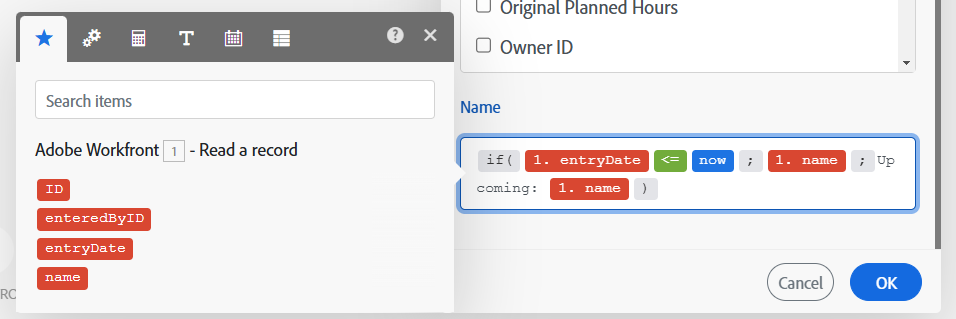

# Mappningsöversikt

Mappning är processen att tilldela en moduls utdata till en annan moduls indatafält.

Funktionen för en modul ger noll, ett eller flera paket som utdata. Ett paket består av ett eller flera objekt.

Du kan mappa dessa objekt till fält i senare moduler.

När du klickar på ett fält där du kan infoga ett värde som matats ut från en föregående modul i ett scenario, visas mappningspanelen. Här kan du markera det objekt som du vill mappa. En mappning kan innehålla ett eller flera av följande:

* Ett enstaka objekt
* Flera objekt
* Statisk text
* Funktioner

>[!BEGINSHADEBOX]

**Exempel**:

Ett objekt

Flera objekt med text

Funktion med flera objekt och text

>[!ENDSHADEBOX]

Instruktioner om mappning finns i artiklarna under [Kartdata: artikelindex](/help/workfront-fusion/create-scenarios/map-data/map-data-toc.md).

>[!NOTE]
>
>Utdata från moduler som är inkapslade mellan [!UICONTROL Iterator] och [!UICONTROL Aggregator] är inte tillgängliga utanför modulen [!UICONTROL Aggregator].

## Mappningspanelen

När du klickar i ett fält där du kan mappa data öppnas mappningspanelen.

På den första fliken  visas objekt som du kan mappa från andra moduler.

De andra flikarna innehåller funktioner, operatorer och nyckelord som du kan använda för att skapa formler. Dessa sorteras på olika flikar baserat på vilken typ av data de hanterar.

Mer information om funktionsflikar finns i [Funktionsöversikt](/help/workfront-fusion/get-started-with-fusion/understand-fusion/function-overview.md).

Mer information om att mappa objekt med funktioner finns i [Mappa objekt med funktioner](/help/workfront-fusion/create-scenarios/map-data/map-using-functions.md).

## Samlingar

Objekt kan innehålla flera värden av olika typer. Det här är objekt av samlingstyp.

Samlingstyppaket visar `(Collection)` bredvid paketetiketten i modulutdata.

I de flesta fall mappar du samlingens element i stället för att mappa objektet som representerar hela samlingen.

Om du vill hitta elementet i en samling på mappningspanelen klickar du på pilen bredvid samlingen.

Mer information om samlingar finns i [Objektdatatyper](/help/workfront-fusion/references/mapping-panel/data-types/item-data-types.md).

Instruktioner om hur du mappar samlingar finns i [Mappa ett objekt](/help/workfront-fusion/create-scenarios/map-data/map-data-from-one-to-another.md#map-an-item) i artikeln Mappa information från en modul till en annan.

## Arrayer

Objekt kan innehålla flera värden av samma typ. Dessa är arraytypsobjekt.

Paket av matristyp visar `(Array)` bredvid paketetiketten i modulutdata.

På mappningspanelen visas arrayer med hakparenteser. Du kan identifiera ett arraytypobjekt med hakparenteser i slutet av objektets etikett. Om du vill hitta ett specifikt arrayelement på mappningspanelen klickar du på pilen bredvid arrayen.

Mer information och instruktioner om att mappa arrayer och arrayelement finns i [Mappa arrayer och arrayelement](/help/workfront-fusion/create-scenarios/map-data/map-an-array.md).
