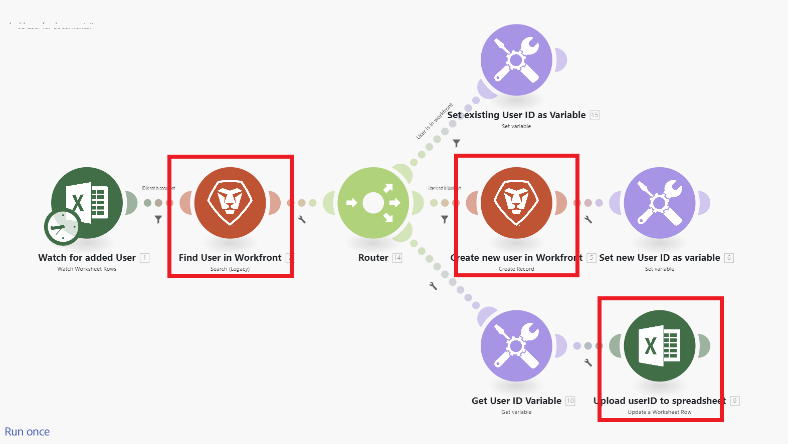

# Scenarioöversikt

Adobe Workfront Fusions roll är att automatisera era processer så att användarna inte behöver lägga så mycket tid på rutinuppgifter. Det fungerar genom att länka åtgärder inom och mellan program och tjänster för att skapa ett scenario som överför och omvandlar data automatiskt. Scenariot du skapar letar efter data i en app eller tjänst och bearbetar data för att ge det resultat du vill ha.

Ett scenario består av en serie moduler som anger hur data ska omvandlas i en app eller överföras mellan program och webbtjänster.

## Översikt över scenarioelement

Ett scenario består av olika element. Om du förstår terminologin för dessa element blir det enklare att använda dokumentationen.

* [Scenario](#scenario)
* [Utlösare](#trigger)
* [Modul](#module)
* [Flöde](#route)
* [Scenariosegment](#scenario-segment)
* [Koppling](#connector)

### Scenario

Ett **scenario** är en användarskapad serie med automatiska steg som skapats för att flytta och ändra data. Termen scenario avser hela gruppen med anslutna steg.

### Utlösare

Ett scenario börjar med en **utlösare**. Utlösaren söker efter nya och uppdaterade data och startar scenariot när vissa villkor som har konfigurerats i modulen tillämpas. Utlösare kan konfigureras för att starta ett scenario enligt ett schema (avsökning) eller när dataändringar sker (direkt).

### Modul

Utlösaren följs av ett antal **moduler**. En modul representerar ett steg i ett scenario som utför en viss åtgärd. Moduler är konfigurerade och sammankopplade för att skapa scenarier.

### Flöde

Ett scenario kan delas upp i **vägar**. En väg är en del av scenariot som kan användas eller inte för ett givet datapaket. Rutorna konfigureras med hjälp av en routermodul och filter.

### Scenariosegment

Ett scenariesegment är ett avsnitt i ett scenario som består av en serie sammanhängande moduler som alla ansluter till samma program. Scenariosegment representerar ofta ett kort arbetsflöde i programmet.

### Koppling

En koppling är en uppsättning moduler för ett visst program. Workfront Fusion har kopplingar till många vanliga arbetsapplikationer, som Workfront, Salesforce och Jira, samt generiska anslutningar som kan användas för alla webbtjänster.

## Exempel

Expandera följande avsnitt för att visa exempelscenarier och deras förklaringar.

+++**Automatisera processer i Adobe Workfront**

Med Workfront Fusion kan du automatisera enkla eller komplexa arbetsflöden i Workfront, vilket sparar tid och säkerställer att processen utförs på ett enhetligt sätt.

I det här exemplet utlöses scenariot när ett angivet fält ändras i en aktivitet eller ett problem i [!DNL Workfront]. När scenariot aktiveras hämtas information i det relaterade projektet och en skräddarsydd uppdatering skapas för en person som tilldelats en specifik roll i projektet.

+++

+++**Ansluta Workfront till en annan app eller webbtjänst**

>[!NOTE]
>
>Om din organisation använder den äldre licensmodellen måste din organisation ha en Workfront Fusion for Work Automation- och Integration-licens för att kunna ansluta till andra program.

Workfront Fusion kan ansluta till andra program och webbtjänster. Du kan komma åt, importera, ändra och exportera data från andra program och integrera dem med Workfront eller med varandra.

Många program har dedikerade [!DNL Workfront Fusion]-anslutningar. Om det inte finns någon dedikerad anslutning för programmet som du vill komma åt kan du använda Workfront Fusions HTTP- eller SOAP-moduler för att ansluta till programmet via dess API.

I det här exemplet utlöses scenariot när en användare läggs till i ett [!DNL Excel]-kalkylblad. Scenariot kontrollerar om användaren är i [!DNL Workfront]. Om så inte är fallet skapas användaren i [!DNL Workfront] och användar-ID:t för Workfront läggs tillbaka i kalkylbladet.

En lista över dedikerade anslutningar finns i [Fusion-program och deras modulreferenser: artikelindex](/help/workfront-fusion/references/apps-and-modules/apps-and-modules-toc.md).

>[!IMPORTANT]
>
>[!DNL Adobe Workfront Fusion] kan ansluta till nästan alla webbtjänster. Om appen du vill arbeta med inte har någon dedikerad [!DNL Workfront Fusion]-anslutning använder du universella anslutningar för att ansluta till appen eller tjänsten.
>
>En lista över universella anslutningar finns i [Universella anslutningar](/help/workfront-fusion/references/apps-and-modules/apps-and-modules-toc.md#universal-connectors)

+++

## Referenser

* En ordlista med termer som används i Workfront Fusion finns i [Adobe Workfront Fusion-ordlistan](/help/workfront-fusion/get-started-with-fusion/understand-fusion/fusion-glossary.md).
* Information om hur du börjar skapa ett praktikscenario finns i [Skapa ett enkelt scenario](/help/workfront-fusion/build-practice-scenarios/create-basic-scenario.md).
* Mer information om att skapa och hantera scenarier finns i artiklarna nedan:
   * [Skapa scenarier](/help/workfront-fusion/create-scenarios/create-scenarios-toc.md)
   * [Hantera scenarier](/help/workfront-fusion/manage-scenarios/manage-scenarios-toc.md)
