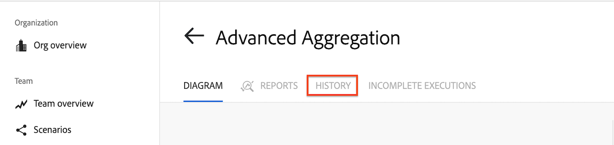

# Visa en specifik scenariekörning

Du kan visa information om en viss scenariokörning, inklusive filtrering och sökning efter scenariohändelser.

## Åtkomstkrav

+++ Expandera om du vill visa åtkomstkrav för funktionerna i den här artikeln.

<table style="table-layout:auto">
 <col> 
 <col> 
 <tbody> 
  <tr> 
   <td role="rowheader">Adobe Workfront package</td> 
   <td> 
Alla Adobe Workfront Workflow-paket och alla Adobe Workfront Automation and Integration-paket

Workfront Ultimate

Workfront Prime- och Select-paket med ytterligare köp av Workfront Fusion.
 </td> 
  </tr> 
  <tr data-mc-conditions=""> 
   <td role="rowheader">Adobe Workfront-licenser</td> 
   <td> 
Standard

Arbeta eller högre
 </td> 
  </tr> 
  <tr> 
   <td role="rowheader">Produkt</td> 
   <td>
   
Om ni har ett Select- eller Prime Workfront-paket som inte innehåller Workfront Automation and Integration måste ni köpa Adobe Workfront Fusion.</li></ul>
   </td> 
  </tr>
 </tbody> 
</table>

Mer information om informationen i den här tabellen finns i [Åtkomstkrav i dokumentationen](/help/workfront-fusion/references/licenses-and-roles/access-level-requirements-in-documentation.md).

+++

## Visa en specifik körning

Du kan visa en körning från scenariohistoriken.

1. Klicka på fliken **[!UICONTROL Scenario]** i den vänstra panelen och klicka sedan på scenariot.

   eller

   Om du arbetar med scenariot i scenredigeraren klickar du på vänsterpilen  i fönstrets övre vänstra hörn.

1. Klicka på **Historik** bredvid namnet på scenariot.
   

1. Leta reda på den körning som du vill visa och klicka på **Detaljer** längst till höger på raden för den körningen. Länken [!UICONTROL details] är bara synlig om körningen har tillgängliga detaljer.

   Scendiagrammet öppnas med körningsinformationspanelen öppen till höger.

   Moduler som genererade utdata för den här körningen är markerade med gröna titlar.

   Moduler som inte kördes är nedtonade.

1. Om du vill visa utdata från en modul klickar du på utdatadetaljbubblan nära modulen. Talet i bubblan representerar antalet paket som modulen genererar.

   

1. Klicka på filtret för att visa de paket som passerat genom ett filter. Siffran nära filtret representerar antalet paket som passerat filtret.
1. Om du vill söka efter en specifik modul eller händelse på körningspanelen anger du söktermen i rutan **Sökningshändelser**. Resultaten visas när du skriver.
1. Om du vill begränsa sökresultaten på körningspanelen efter status som Slutfört eller Varning klickar du på listrutan **Statusfilter** och väljer status.

>[!NOTE]
>
>Om du vill skapa en länk till en viss modul lägger du till `?moduleId=<module-id>` i URL:en när du visar följande sidor:
>
>* Scenarioredigeringssida (URL:en slutar på `/edit`)
>* En specifik scenariokörning (URL:en slutar på `/logs/<log-id>`)
>
>`<module-id>` refererar till numret bredvid moduletiketten när du visar scenariot.
>
>Detta kan vara användbart vid felsökning eller kopiering av modulkonfiguration.
