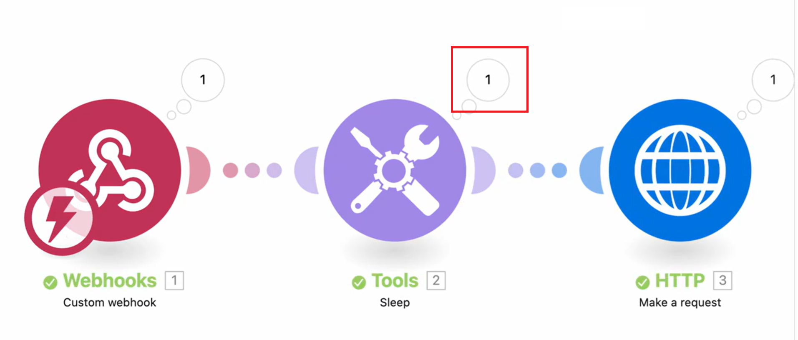

# Visa dataflöde i ett pågående scenario

Du kan titta på ett scenario som körs för att se hur data flödar genom det.

När ett scenario körs markeras den aktiva modulen med en växande ring runt modulen. Ringen visar bara att modulen körs, inte dess förlopp. Moduler som körs snabbt kan bara visa en liten del av ringen.

När modulen har körts visas en utdataindikator.

Om modulen bearbetar mer än en stötfångare visas ringen för varje bearbetat paket och utdataindikatorn räknas upp för varje paket som den matar ut.

Mer information om dataflöde för scenarier finns i [Körningsflöde för scenarier](/help/workfront-fusion/references/scenarios/scenario-execution-flow.md).

## Åtkomstkrav

+++ Expandera om du vill visa åtkomstkrav för funktionerna i den här artikeln.

Du måste ha följande åtkomst för att kunna använda funktionerna i den här artikeln:

<table style="table-layout:auto">
 <col> 
 <col> 
 <tbody> 
  <tr> 
   <td role="rowheader">[!DNL Adobe Workfront] package</td> 
   <td> 
Alla
 </td> 
  </tr> 
  <tr data-mc-conditions=""> 
   <td role="rowheader">[!DNL Adobe Workfront] licens</td> 
   <td> 
Nytt: [!UICONTROL Standard]

eller

Aktuell: [!UICONTROL Work] eller högre
 </td> 
  </tr> 
  <tr> 
   <td role="rowheader">[!DNL Adobe Workfront Fusion] licens**</td> 
   <td>
   
Aktuell: Inga [!DNL Workfront Fusion]-licenskrav.

   
eller

   
Äldre: Alla 

   </td> 
  </tr> 
  <tr> 
   <td role="rowheader">Produkt</td> 
   <td>
   
Nytt:
 <ul><li>[!UICONTROL Select] eller [!UICONTROL Prime] [!DNL Workfront]: Din organisation måste köpa [!DNL Adobe Workfront Fusion].</li><li>[!UICONTROL Ultimate] [!DNL Workfront] plan: [!DNL Workfront Fusion] ingår.</li></ul>
   
eller

   
Aktuell: Din organisation måste köpa [!DNL Adobe Workfront Fusion].

   </td> 
  </tr>
  <tr data-mc-conditions=""> 
   <td role="rowheader">Konfigurationer på åtkomstnivå*</td> 
   <td> 
     
Du måste vara administratör för [!DNL Workfront Fusion] för din organisation.

     
Du måste vara administratör för [!DNL Workfront Fusion] för ditt team.

   </td> 
  </tr> 
   </td> 
  </tr> 
 </tbody> 
</table>

Mer information om informationen i den här tabellen finns i [Åtkomstkrav i dokumentationen](/help/workfront-fusion/references/licenses-and-roles/access-level-requirements-in-documentation.md).

Mer information om [!DNL Adobe Workfront Fusion] licenser finns i [[!DNL Adobe Workfront Fusion] licenser](/help/workfront-fusion/set-up-and-manage-workfront-fusion/licensing-operations-overview/license-automation-vs-integration.md).

+++

## Visa dataflöde i ett pågående scenario

1. Klicka på fliken **[!UICONTROL Scenarios]** i den vänstra panelen.
1. Välj det scenario där du vill visa dataflöde.
1. Om scenariot inte körs aktiverar du det eller klickar på **Kör en gång** för att starta scenariokörningen.
1. Välj den körning som du vill visa i avsnittet Körs för närvarande på körningshistorikpanelen.

 just nu

