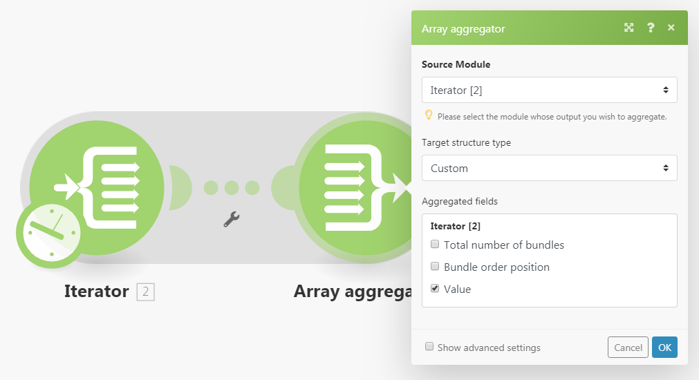

# modulen [!UICONTROL Aggregator]

En aggregeringsmodul är en modul som sammanfogar flera datapaket till ett enda paket.

## Åtkomstkrav

+++ Expandera om du vill visa åtkomstkrav för funktionerna i den här artikeln.

<table style="table-layout:auto">
 <col> 
 <col> 
 <tbody> 
  <tr> 
   <td role="rowheader">Adobe Workfront package</td> 
   <td> 
Alla Adobe Workfront Workflow-paket och alla Adobe Workfront Automation and Integration-paket

Workfront Ultimate

Workfront Prime- och Select-paket med ytterligare köp av Workfront Fusion.
 </td> 
  </tr> 
  <tr data-mc-conditions=""> 
   <td role="rowheader">Adobe Workfront-licenser</td> 
   <td> 
Standard

Arbeta eller högre
 </td> 
  </tr> 
  <tr> 
   <td role="rowheader">Produkt</td> 
   <td>
   
Om ni har ett Select- eller Prime Workfront-paket som inte innehåller Workfront Automation and Integration måste ni köpa Adobe Workfront Fusion.</li></ul>
   </td> 
  </tr>
 </tbody> 
</table>

Mer information om informationen i den här tabellen finns i [Åtkomstkrav i dokumentationen](/help/workfront-fusion/references/licenses-and-roles/access-level-requirements-in-documentation.md).

+++## [!UICONTROL Aggregator] - översikt

När en [!UICONTROL Aggregator]-modul körs gör den följande:

* Ackumulerar alla paket från en enda källmoduls åtgärd.
* Ger ett paket med en array som innehåller ett objekt per ackumulerat paket. Innehållet i arrayens objekt beror på den aktuella [!UICONTROL Aggregator]-modulen och dess inställningar.

I följande bild visas en typisk inställning för modulen [!UICONTROL Aggregator]:

<table style="table-layout:auto">
 <col> 
 <col> 
 <tbody> 
  <tr> 
   <td> 
[!UICONTROL Source Module]
 </td> 
   <td> 
Modulen där paketaggregeringen startar. Källmodulen är vanligtvis en iterator eller en sökmodul som matar ut en serie paket.

När du konfigurerar aggregatorns källmodul (och stänger aggregatorns inställning), kapslas vägen mellan källmodulen och aggregatormodulen in i ett grått område så att du tydligt kan se början och slutet av aggregeringen. 
   
 
Mer information om iteratorer finns i <a href="/help/workfront-fusion/references/modules/iterator-module.md" class="MCXref xref">[!UICONTROL Iterator] modul</a>.
 
   
Mer information om sökmoduler finns i <a href="/help/workfront-fusion/get-started-with-fusion/understand-fusion/module-overview.md#search-modules" class="MCXref xref">Sökmoduler</a> i modulöversikt.
 </td> 
  </tr> 
  <tr> 
   <td> 
[!UICONTROL Target structure type]

(Gäller endast för modulen [!UICONTROL Array aggregator].)
 </td> 
   <td> 
 Målstrukturen där data sammanställs. Med standardalternativet, [!UICONTROL Custom], kan du välja objekt som ska aggregeras i [!UICONTROL Array aggregator]objektet för utdatapaketet i <code>Array </code>:
 
  
 
När du har anslutit fler moduler efter modulen [!UICONTROL Array aggregator] och återgår till aggregeringsmodulens inställningar innehåller listrutan för strukturtypen [!UICONTROL Target] alla följande moduler och deras fält som är av typen "Array of Collections". 
I det här exemplet visas fältet [!UICONTROL Attachments] i modulen [!DNL Slack] &gt;[!UICONTROL Create a Message] i fältet Array-aggregator &gt; Typ av målstruktur. 
 
  
 </td> 
  </tr> 
  <tr> 
   <td>[!UICONTROL Aggregated fields]</td> 
   <td>De fält som du vill inkludera i aggregeringsmodulens utdata.</td> 
  </tr> 
  <tr> 
   <td> 
[!UICONTROL Group by]
 </td> 
   <td> 
Med fältet Gruppera efter kan du definiera ett uttryck som innehåller ett eller flera mappade objekt. De aggregerade data delas sedan upp i grupper med värdet för uttrycket. Varje grupp genererar som ett separat paket som innehåller en nyckel och en array med data. Genom att gruppera resultaten kan du använda Key (Nyckel) som ett filter i efterföljande moduler.

   
Varje paket innehåller två objekt:
 
    <ul> 
     <li><code>Key</code>: Det värde som du grupperar efter.</li> 
     <li><code>Array</code>: De aggregerade data från de paket som formeln utvärderade till värdet <code>Key</code> för.</li> 
    </ul> </td> 
  </tr> 
  <tr> 
   <td> 
Stoppa bearbetning efter en tom aggregering
 </td> 
   <td> 
Som standard genererar modulen [!UICONTROL Aggregator] resultatet av aggregeringen även när inga paket har nått modulen [!UICONTROL Aggregator] (till exempel eftersom de har filtrerats bort från sökvägen som innehåller aggregatorn). Om alternativet [!UICONTROL Stop processing after an empty aggregation] är aktiverat producerar modulen [!UICONTROL Aggregator] inga utdatapaket när det inte finns några indatapaket. Flödet stoppas i stället.
 </td> 
  </tr> 
 </tbody> 
</table>

>[!NOTE]
>
>Paket som genereras av moduler mellan källmodulen och modulen [!UICONTROL Aggregator] genereras inte av modulen [!UICONTROL Aggregator]. Dessa paket är inte tillgängliga för modulerna i flödet efter [!UICONTROL Aggregator]. Om du behöver data från ett paket som matats ut av en modul mellan källmodulen och [!UICONTROL Aggregator]-modulen, måste du se till att inkludera det angivna objektet i [!UICONTROL Aggregator]-modulens inställningar (till exempel i fältet [!UICONTROL Aggregated fields] i inställningarna för [!UICONTROL Array aggregator] -modulen).

## Exempelscenario för hur aggregerare fungerar

I det här exempelscenariot visas hur du komprimerar alla e-postbilagor och överför ZIP till [!DNL Dropbox].

Scenariot nedan visar hur man gör:

* Den första modulen bevakar en postlåda för inkommande e-post. Utlösaren [!UICONTROL Email] >[!UICONTROL Watch emails] skickar ett paket med objektet `Attachments[]`, som är en array som innehåller alla e-postbilagor.

* Den andra modellen itererar om e-postens bilagor: [!UICONTROL Email] >[!UICONTROL Iterate attachments] iterator tar objekten från `Attachments[]`-arrayen en i taget och skickar dem vidare som separata paket.

* Den tredje modulen är aggregatorn. Den aggregerar de paket som matas ut av modulen [!UICONTROL Email] >[!UICONTROL Iterate attachments]. [!UICONTROL Archive] >[!UICONTROL Create an archive aggregator] samlar alla paket som den tar emot och skickar ut ett enda paket som innehåller ZIP-filen.

* Den sista modulen överför den resulterande ZIP-filen till [!DNL Dropbox].  [!DNL Dropbox] > [!UICONTROL Upload a file] hämtar ZIP-filen från modulen [!UICONTROL Archive] > [!UICONTROL Create an archive] och överför den till [!DNL Dropbox].

Nedan visas ett exempel på konfiguration av [!UICONTROL Archive] > [!UICONTROL Create an archive]-aggregatorn:

