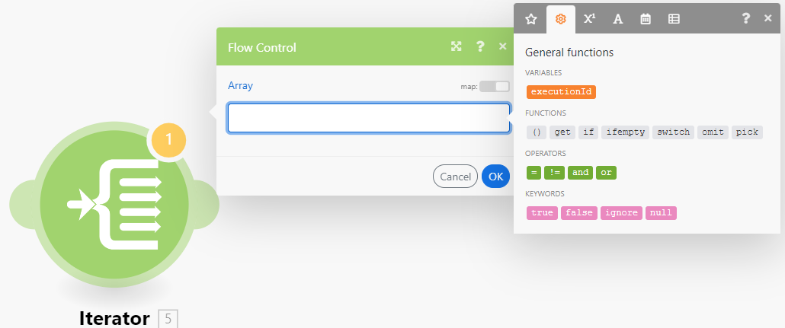

# modulen [!UICONTROL Iterator]

En [!UICONTROL Iterator] är en typ av modul som konverterar en array till en serie paket. Varje arrayobjekt genereras som ett separat paket.

## Åtkomstkrav

+++ Expandera om du vill visa åtkomstkrav för funktionerna i den här artikeln.

Du måste ha följande åtkomst för att kunna använda funktionerna i den här artikeln:

<table style="table-layout:auto">
 <col> 
 <col> 
 <tbody> 
  <tr> 
    <td role="rowheader">Adobe Workfront package</td> 
   <td> 
Alla
 </td> 
  </tr> 
  <tr data-mc-conditions=""> 
   <td role="rowheader">Adobe Workfront-licens</td> 
   <td> Nytt: Standard
eller

Aktuell: Arbete eller högre
 </td> 
  </tr> 
  <tr> 
   <td role="rowheader">[!UICONTROL Adobe Workfront Fusion] licens</td> 
   <td>
   
Aktuell: Inga Workfront Fusion-licenser krävs.

   
eller

   
Äldre: Alla 

   </td> 
  </tr> 
  <tr> 
   <td role="rowheader">Produkt</td> 
   <td>
   
Nytt:
 <ul><li>[!UICONTROL Select] eller [!UICONTROL Prime] Workfront-plan: Din organisation måste köpa Adobe Workfront Fusion.</li><li>[!UICONTROL Ultimate] Workfront: Workfront Fusion ingår.</li></ul>
   
eller

   
Aktuell: Din organisation måste köpa Adobe Workfront Fusion.

   </td> 
  </tr>
 </tbody> 
</table>

Kontakta Workfront-administratören om du vill veta vilken plan, licenstyp eller åtkomst du har.

Mer information om Adobe Workfront Fusion-licenser finns i [Adobe Workfront Fusion-licenser](/help/workfront-fusion/set-up-and-manage-workfront-fusion/licensing-operations-overview/license-automation-vs-integration.md).

+++

## Modulkonfiguration för [!UICONTROL Iterator]

Den allmänna iteratormodulen har ett enda fält, fältet [!UICONTROL Array]. Det här fältet innehåller arrayen som ska konverteras eller delas upp i separata paket.

Andra kopplingar kan innehålla iteratormoduler som är specifika för den iteratorn. Dessa innehåller ett Source-modulfält, där du kan markera modulen som returnerar den array som du vill iterera från.

Mer information finns i [Konfigurera en modul](/help/workfront-fusion/create-scenarios/add-modules/configure-a-modules-settings.md).

>[!BEGINSHADEBOX]

**Exempel:**

* I nedanstående scenario visas hur du hämtar e-postmeddelanden med bilagor och sparar de bifogade filerna som enskilda filer i en vald [!DNL Dropbox]-mapp.

  E-postmeddelanden kan innehålla en array med bilagor. Modulen [!UICONTROL Iterator] efter den första modulen gör att scenariot kan hantera varje bifogad fil separat. Modulen [!UICONTROL Iterator] delar upp arrayen med bilagor i enskilda paket. Varje paket, med en bifogad fil, sparas sedan en i taget i en markerad [!DNL Dropbox]-mapp. Fältet [!UICONTROL Array] i iteratormodulen ska innehålla arrayen `Attachments`.

  

>[!ENDSHADEBOX]

## Felsökning

### Problem: Mappningspanelen visar inte mappningsbara objekt i modulen [!UICONTROL Iterator]

När en [!UICONTROL Iterator]-modul inte har information om strukturen för arrayens objekt, visar mappningspanelen i modulerna efter [!UICONTROL Iterator]-modulen bara två objekt under [!UICONTROL Iterator]-modulen: `Total number of bundles` och `Bundle order position`.

Detta beror på att varje modul ansvarar för att tillhandahålla information om de objekt den skickar ut, så att dessa objekt kan visas korrekt på mappningspanelen i efterföljande moduler. Det kan dock hända att flera moduler inte kan tillhandahålla den här informationen i vissa fall. [!UICONTROL JSON] > [!UICONTROL Parse JSON] eller [!UICONTROL Webhooks] > [!UICONTROL Custom Webhook] moduler som saknar datastruktur ger till exempel ingen information.

#### Lösning

Lösningen är att manuellt köra scenariot. Detta tvingar modulen att skapa utdata. Fusion kan sedan använda formatet för detta utdata på senare moduler i scenariot.

Ett scenario innehåller till exempel en [!UICONTROL JSON] > [!UICONTROL Parse JSON]-modul utan datastruktur.

En [!UICONTROL Iterator]-modul som är ansluten till den här JSON-modulen kan inte mappa modulens utdata till fältet Array på inställningspanelen i modulen [!UICONTROL Iterator].

Så här löser du det:

Starta scenariot manuellt i scenarioredigeraren.

>[!NOTE]
>
>Om du vill förhindra att hela scenariot körs kan du:
>
>* Avlänka modulerna efter modulen [!UICONTROL JSON] > [!UICONTROL Parse JSON] för att förhindra att flödet fortsätter.
>  &#x200B;>   eller
>* Högerklicka på modulen [!UICONTROL JSON] > [!UICONTROL Parse JSON] och välj **[!UICONTROL Run this module only]** på snabbmenyn om du bara vill köra modulen [!UICONTROL JSON] > [!UICONTROL Parse JSON] .

När [!UICONTROL JSON] > [!UICONTROL Parse JSON] har körts kan den sedan tillhandahålla information om dess utdata till alla efterföljande moduler, inklusive Iterator-modulen. Mappningspanelen i Iteratorns inställningar visar sedan objekten:

Mappningspanelen i modulerna som är anslutna efter modulen [!UICONTROL Iterator] visar dessutom objekten i arrayen:

