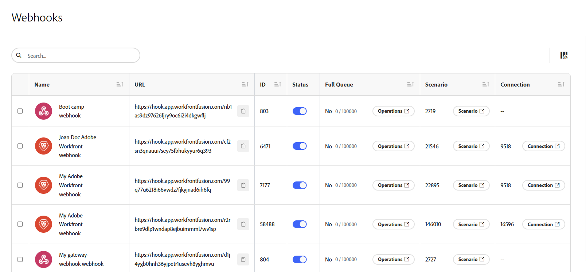

# Direktutlösare (webhooks)

Många tjänster tillhandahåller webhooks för att leverera snabbmeddelanden när en viss ändring (händelse) inträffar i tjänsten. Om du vill bearbeta de här händelserna rekommenderar vi att du använder snabbutlösare. Direktutlösare visar taggen `Instant` i listan med moduler för en given koppling.

>[!TIP]
>
>Du kan kontrollera listan med moduler i en koppling för att se om den har en direktutlösare, eller så kan du kontrollera den anslutarens dokumentation under [Fusion-program och deras modulreferenser](/help/workfront-fusion/references/apps-and-modules/apps-and-modules-toc.md).
>
>Dokumentation om Adobe Workfront direktutlösare finns i [Utlösare](/help/workfront-fusion/references/apps-and-modules/adobe-connectors/workfront-modules.md#triggers) i artikeln Workfront-moduler.

Om en anslutning inte innehåller någon webkrok kan du göra något av följande:

* Skapa en anpassad webkrok med Webkrok-modulen.
Mer information finns i [Webhooks](/help/workfront-fusion/references/apps-and-modules/universal-connectors/webhooks-updated.md).
* Använd avsökningsutlösare för att regelbundet avsöka tjänsten.
Mer information finns i [Schemalägg ett scenario](/help/workfront-fusion/create-scenarios/config-scenarios-settings/schedule-a-scenario.md)

En videointroduktion till webbhooks i Workfront Fusion finns på:

* [Introduktion till Webhooks](https://video.tv.adobe.com/v/3427025/){target=_blank}
* [Mellanliggande webbhooks](https://video.tv.adobe.com/v/3427030/){target=_blank}

## Åtkomstkrav

+++ Expandera om du vill visa åtkomstkrav för funktionerna i den här artikeln.

<table style="table-layout:auto">
 <col> 
 <col> 
 <tbody> 
  <tr> 
   <td role="rowheader">Adobe Workfront package</td> 
   <td> 
Alla Adobe Workfront Workflow-paket och alla Adobe Workfront Automation and Integration-paket

Workfront Ultimate

Workfront Prime- och Select-paket med ytterligare köp av Workfront Fusion.
 </td> 
  </tr> 
  <tr data-mc-conditions=""> 
   <td role="rowheader">Adobe Workfront-licenser</td> 
   <td> 
Standard

Arbeta eller högre
 </td> 
  </tr> 
  <tr> 
   <td role="rowheader">Produkt</td> 
   <td>
   
Om ni har ett Select- eller Prime Workfront-paket som inte innehåller Workfront Automation and Integration måste ni köpa Adobe Workfront Fusion.</li></ul>
   </td> 
  </tr>
 </tbody> 
</table>

Mer information om informationen i den här tabellen finns i [Åtkomstkrav i dokumentationen](/help/workfront-fusion/references/licenses-and-roles/access-level-requirements-in-documentation.md).

+++

## Visa webbkrokinformation

Du kan visa en lista med webbböcker i området Webhooks.

1. Om du vill öppna området Webhooks klickar du på ikonen Webhooks  i den vänstra navigeringen.

   Här visas en lista med webbhooks.

   

1. Om du vill söka efter en specifik webkrok anger du söktermen i sökrutan.
1. Om du vill kopiera en webkrok klickar du på ikonen  nära webbadressen på raden för den webkroken.
1. Om du vill ange prioritet för en webkrok klickar du på listrutan i kolumnen Prioritet och väljer den nya prioriteten.

   Webbhooks med högre prioritet hanteras först, vilket kan vara bra om en arbetarpool har många automatiseringar som konkurrerar om resurser.
1. Om du vill inaktivera eller aktivera en webkrok inaktiverar eller aktiverar du växlingsknappen i statuskolumnen på raden för den webkroken.
1. Om du vill se om en webbhookö är full kontrollerar du kolumnen Full kö. Numret i den här kolumnen är antalet objekt som finns i kön.
1. Om du vill visa åtgärder som hanteras av en webkrok klickar du på **Åtgärder** i kolumnen Fullständig kö för den webkroken.
1. Om du vill se om en webkrok har upphört att gälla markerar du kolumnen Förfallen. Utgångna webhooks är inte kopplade till något scenario eller har inte tagit emot några händelser på 120 timmar.
1. Om du vill visa scenariot där en webkrok används klickar du på knappen **Scenario** i kolumnen Scenario för den webbkroken.
1. Klicka på knappen **Anslutning** i anslutningskolumnen för den webbkroken om du vill visa anslutningen som används för den här webkroken.
1. Om du vill dölja kolumner eller visa tidigare dolda kolumner klickar du på ikonen **Kolumner**  och markerar eller avmarkerar kolumnnamn.
1. Om du vill visa händelseprenumerationer som är kopplade till en Workfront-webkrok markerar du kryssrutan bredvid webkroken och väljer **Visa detaljer** längst ned på sidan.

   >[!NOTE]
   >
   > Information om händelseprenumerationer finns endast för Workfront webbhooks som har skapats i den nya Workfront Connector. Webkrokinformation är för närvarande inte tillgänglig för andra anslutningar.

## Schemalägg direktutlösare

När du konfigurerar en direktutlösare uppmanas du att välja när den körs.

Välj `Immediately` om du vill köra scenariot omedelbart när Workfront Fusion tar emot nya händelser från tjänsten. Dessa händelser skickas omedelbart till en kö och bearbetas sedan i scenariot en i taget i samma ordning som data tas emot.

När scenariot körs räknas det totala antalet väntande händelser som väntar i kön, och scenariot utför så många cykler som det finns väntande händelser, och en händelse bearbetas per cykel.

Mer information om cykler finns i [Scenariokörning, cykler och faser](/help/workfront-fusion/references/scenarios/scenario-execution-cycles-phases.md).

>[!NOTE]
>
>* En cykel är inte detsamma som en scenariokörning. Det kan finnas flera cykler i en och samma scenario.
>* När du kör ett scenario med en utlösare som är schemalagd att köras `Immediately` gäller följande undantag:
>
>     * Intervallet mellan två körningar omfattas inte av minimiintervallet enligt prissättningsplanen.
>
>       När till exempel scenariot har slutförts kontrolleras webbkrokens kö igen. Om det finns några väntande webbhooks körs scenariot omedelbart igen och alla väntande webbhooks bearbetas igen.
>   
>     * Inställningen för maximalt antal cykler ignoreras och ställs in på 100, vilket innebär att högst 100 väntande webbhooks bearbetas under en enda scenariokörning (med en hastighet på 1 händelse per cykel).
>

Om du använder någon annan schemainställning än [!UICONTROL Immediately] körs scenariot med de intervall du anger. Eftersom det går att samla in flera webbböcker i kön under intervallet rekommenderar vi att du anger ett högre värde för alternativet [!UICONTROL Maximum number of cycles] än standardvärdet 1 för att bearbeta fler webbhooks i en enda scenariokörning:

1. Klicka på ikonen [!UICONTROL Scenario settings]  längst ned i ditt scenario.
1. På panelen **[!UICONTROL Scenario settings]** som visas anger du en siffra i fältet **[!UICONTROL Max number of cycles]** som anger antalet händelser från kön som du vill köra varje gång du kör scenariot.

Återstående händelser i kön bearbetas nästa gång scenariot körs, upp till det antal som anges i fältet Max antal cykler.

## Webkrokskyddsräcken

För att säkerställa goda prestanda har Workfront Fusion följande skyddsräcken på plats för webhooks.

### Kursgränser

Den aktuella hastighetsgränsen är 5 webbhooks per sekund. Om gränsen överskrids returneras en `429`-statuskod.

### Inaktiva webhooks förfaller

En webkrok som inte har tilldelats något scenario på mer än 120 timmar tas bort.

### Webkrok-nyttolaster

Workfront Fusion lagrar webkrocknyttolaster i 30 dagar. Om du får åtkomst till en webkrok-nyttolast mer än 30 dagar efter att den skapades uppstår felet [!UICONTROL `Failed to read file from storage.`]

### Felhantering

När det finns ett fel i ditt scenario med en direktutlösare:

* Stoppar omedelbart när scenariot är inställt på att köra [!UICONTROL Immediately].
* Stoppar efter 3 misslyckade försök (3 fel) när scenariot är inställt på att köras enligt schema.

Om ett fel inträffar under scenariokörningen placeras händelsen tillbaka i kön under snabbutlösarens återställningsfas. I sådana fall kan du åtgärda scenariot och köra det igen.

Mer information finns i [Återställning](/help/workfront-fusion/references/scenarios/scenario-execution-cycles-phases.md#rollback) i artikeln Scenariokörning, cykler och faser.

Om det finns en Webkroks svarsmodul i ditt scenario skickas felet till Webkroks svar. Webkroks svarsmodul körs alltid sist (när alternativet [!UICONTROL Auto commit] i scenarieinställningarna inte är aktiverat).

Mer information finns i [Svara på webhooks](/help/workfront-fusion/references/apps-and-modules/universal-connectors/webhooks-updated.md#responding-to-webhooks) i artikeln Webbhooks.

### Webkroks-inaktivering

Webhooks inaktiveras automatiskt om något av följande gäller:

* Webbkroken har inte varit ansluten till något scenario på mer än fem dagar.
* Webkroken används bara i inaktiva scenarier, som har varit inaktiva i mer än 30 dagar.

Inaktiverade webhooks tas bort och avregistreras automatiskt om de inte är anslutna till några scenarier och har varit i inaktiveringsstatus i över 30 dagar.

## Anpassade webbhotell

Du kan skapa egna webbböcker. Mer information finns i [Webhooks](/help/workfront-fusion/references/apps-and-modules/universal-connectors/webhooks-updated.md).

## Resurser

Mer information om cykler finns i [Scenariokörning, cykler och faser](/help/workfront-fusion/references/scenarios/scenario-execution-cycles-phases.md).
