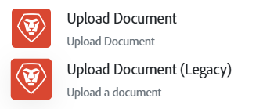

# Arbeta med stora filer

>[!IMPORTANT]
>
>Stora filfunktioner är bara tillgängliga för företag som har Workfront Ultimate-paketet.

Förbättrade dataöverföringsfunktioner finns nu i Workfront Fusion, vilket gör att man kan hantera betydligt större filer i olika scenarier.

Om du vill hantera större filer måste du uppdatera dina scenarier.

## Kopplingar som stöder stora filer

För närvarande har följande kopplingar stöd för stora filer.

>[!NOTE]
>
>* Om en fil laddas ned med en modul som stöder stora filer och sedan skickas till en modul som inte stöder stora filer, bearbetas inte filen korrekt i den modulen. Stora filer måste hanteras exklusivt med moduler som stöds i hela arbetsflödet.
>* Moduler som inte stöder stora filer kan bearbeta filer som är upp till 200 MB stora.

* Workfront
   * Överför dokument
   * Hämta dokument
* Adobe Experience Manager Assets
   * Överför dokument
* Workfront Proof
   * Överför fil
   * Hämta korrektur för
* Adobe Authenticator
   * Göra ett anpassat API-anrop
* Adobe Photoshop
   * Använda PSD Edits
* SharePoint
   * Skapa en fil
   * Hämta en fil
* Salesforce
   * Överför fil
* AWS S3
   * Överför fil
   * Hämta fil
* HTTP

Andra anslutningar stöds i framtida versioner.

## Uppdatera dina scenarier för att hantera stora filer

Modulen Workfront > Överför dokument har ändrats för att hantera större filer. I den tidigare versionen av den här modulen visas nu `(Legacy)` som tillägg till modulnamnet. I de flesta fall fungerar den äldre modulen även i fortsättningen.

Om du planerar att arbeta med större filer rekommenderar vi att du ersätter den gamla modulen med den nya modulen Överför dokument. Den nya modulen Överför dokument förhindrar timeout och andra fel.

## Vanliga frågor och svar

### Vad är den nya storleksgränsen för filer?

Nu kan användare bearbeta filer som överskrider den tidigare 1 GB-gränsen, vilket förbättrar effektiviteten och produktiviteten.  Även om det inte finns någon definierad gräns för filstorlek för Workfront Fusion-plattformen finns det andra faktorer som kan påverka användningen av stora filer:

* **Filstorleksbegränsningar för tjänsten som Fusion ansluter till**: Om tjänsten begränsar filstorleken, kan Workfront Fusion inte överbrygga den begränsningen. Begränsningarna för filstorlek beror i slutändan på webbtjänsten som Fusion ansluter till.

* **Körningstid för scenario**: Filer av valfri storlek bearbetas i Fusion tills körningsgränsen på 40 minuter har nåtts. Stora filer kan ta en stund att överföra, hämta eller bearbeta i ditt Fusion-scenario. Om stora filer gör att körningen tar mer än 40 minuter misslyckas scenariot. Scenarions körningstid kan också påverkas av scenariots storlek, modulens komplexitet och nätverkshastigheten. Därför rekommenderar vi att du tar hänsyn till dessa aspekter av dina scenarier när du använder stora filer.

>[!NOTE]
>
>Vi rekommenderar att du begränsar filstorleken till 15 GB.

### Hur fungerar Fusions nya filöverföring?

När filer bearbetas i Fusion läggs större filer till i beständig lagring (S3 Bucket eller Azure Blob Storage). När en Fusion-modul kör en filåtgärd, som att överföra eller hämta, använder Fusion filen i det beständiga lagringsutrymmet som källa i stället för aktivt minne.

### Kan jag arbeta med större filer med ofullständiga körningar?

Ja, Fusion stöder ofullständiga körningar med större filer. Observera att ofullständiga körningar är begränsade i storlek för en organisation och bör hanteras aktivt.

### Kan jag använda större filer med valfri anslutning?

Varje Fusion-anslutning måste uppdateras för att stödja större filer. De anslutningar som stöds är Workfront, HTTP och AEM Assets. Fusion-anslutningar begränsas fortfarande av den filstorlek som stöds av webbtjänsten. Filstorleksbegränsningar ingår vanligtvis i API-dokumentationen för webbtjänstslutpunkter som hämtar och överför filer.

### Påverkar detta åtgärder?

Nej, antalet åtgärder som utförs av en modul är lika.

### När uppdateras Fusions användargränssnitt för att visa filöverföringsdata?

Den här funktionen har redan slutförts och distribuerats till produktionen.

### Hur tänker jag på de nya filbearbetningsgränserna som kan hjälpa mig att utforma scenarier?

Det kan verka komplicerat att utforma ett scenario som ska fungera inom 40 minuters exekveringsgräns. Vi rekommenderar att du tänker på följande när du utformar ett scenario:

* **Förstå dina affärskrav för körningstid**: Fusions plattformsgräns för körningstid är 40 minuter, men de flesta affärsprocessautomatiseringar förväntas köras mycket snabbare. Exempelvis förväntas användarinitierade automatiseringar med resultatberoende fortsättning att slutföras långt under gränsen på 40 minuter.
* **Överväg körningstid när du utformar**: När du utformar ditt scenario är det viktigt att förstå modulkörningstiden för enskilda filåtgärder, till exempel överföringar och hämtningar. Den här kunskapen hjälper dig att planera scenarier som omfattar flera filåtgärder.  Vi rekommenderar att du avrundar modulens körningstid så att den innehåller en buffert för att försäkra dig om att designen är korrekt.
Om Fusion till exempel hämtar ett dokument på 144 sekunder (2,4 minuter) kan du förutse att en enda körning kan utföra liknande åtgärder flera gånger. I det här exemplet tar det 144 sekunder att köra modulkörningen och du bör planera för 3 minuters körningstid för hämtning. Om dina krav omfattar både en överföring och en nedladdning är den förväntade körningstiden ungefär 6 minuter. Observera att Fusion-körningstiden är begränsad till 40 minuter.

* **Konsolidera filåtgärder**: Det vanligaste exemplet på filåtgärder i ett Fusion-scenario är en hämtning och en överföring. De flesta scenarier med endast dessa två åtgärder kommer att köras på några minuter. När det är möjligt bör Fusion-designers begränsa sina scenarier till en nedladdning och en uppladdning.

* **Beräkna storlek med hjälp av mappningspanelen**: Workfront och andra webbtjänster inkluderar filstorleken för en fil i hämtningsmodulens utdata. Du kan använda dessa data för att filtrera bort filer som är för stora för en modulöverföring eller för stora för att få körningstiden för scenariot.

* **Isolera filåtgärder i ett eget scenario när du arbetar med flera filer**: Fusion-designers bör överväga att isolera filåtgärder i olika scenarier. Ett Fusion-scenario som utlöses av en ny Workfront-begäran med flera bifogade filer kan till exempel behöva innehålla upp till 30 filer. Eftersom det kan ta upp till 3 minuter att överföra och ladda ned varje fil, skulle det ta mer än 40 minuter att bearbeta alla filer i en enda körning än vad Fusions körningsgräns tillåter. Lösningen är att skapa ett scenario för filåtgärder som är dedikerat till att hantera överföring och hämtning av enskilda filer. Scenariot som utlöses av begäran itererar igenom de bifogade filerna och anropar scenariot för filåtgärder för varje fil med HTTP-modulen. På så sätt säkerställs att varje fil bearbetas inom körningstidsgränserna.

<!--
## Connectors that do not support large files

Some Fusion connectors do not support large files. For these connectors, Fusion's total processing capacity for files is **1 GB**. 

This limit is based on a total memory cost. Every operation contributes to that cost. If a single file of 400 MB is downloaded and uploaded then the total cost to the file capacity would be 800 MB.

The following connectors do **not** support large files. 

* Archive
* Box
* Convert
* CSV
* Datastores
* Flow control
* FTP
* JSON
* JWT
* Markdown
* Math
* Microsoft Word templates
* MIME
* Microsoft SQL
* SFTP
* Adobe Acrobat Sign
* SOAP
* Tools
* XML

If a connector is not on this list, it does not support large files. For these connectors, Fusion's total processing capacity for files is **1 GB**. 

This limit is based on a total memory cost. Every operation contributes to that cost. If a single file of 400 MB is downloaded and uploaded then the total cost to the file capacity would be 800 MB.-->

<!--## Connectors that support large files

The following connectors support large files.

Workfront
HTTP
Webhooks
Salesforce
Microsoft Email
Workfront Proof
AEM Assets
Email
Slack
Jira
Microsoft Excel
SharePoint
Frame.io
Adobe PDF Services
Marketo
Azure Devops 
Google Email
Jira Server
Google Sheets
Microsoft OneDrive
ServiceNow 
AWS S3
Bynder
OneDrive Business
Adobe Authenticator
Google Drive
Microsoft Dynamics
Google Docs
NetSuite
Airtable
Azure AD
QuickBase 
Adobe Target
Adobe Campaign Classic
Microsoft Calendar
Workfront Planning
HubSpot CRM  
DropBox
Cloud Convert
Egnyte
Adobe Firefly
OpenAI / Chat GPT
Allocadia
Cvent
GitLab 
Google Team Drive
Google Calendar
Workfront SDL Managed Translation
Widen
Workfront Boards
Google Slides
Qualtrics
Microsoft Power BI
Adobe Photoshop
Anaplan
DocuSign 
MariaDB
Adobe Creative Cloud Libraries
Figma
AEM Forms
Datadog
GitHub 
Google Forms
Adobe I/O Events
Trello
Workday
Adobe Journey Optimizer
Adobe Lightroom

If a file is not on this list, it does not support large files. For these connectors, Fusion's total processing capacity for files is **1 GB**. 

This limit is based on a total memory cost. Every operation contributes to that cost. If a single file of 400 MB is downloaded and uploaded then the total cost to the file capacity would be 800 MB.

-->
