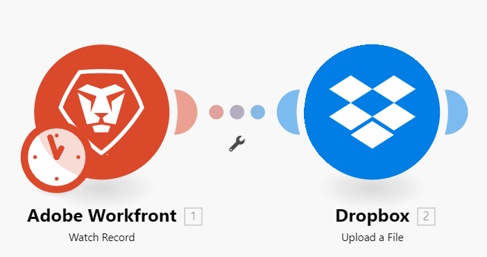

# Körningsflöde för scenarier

I den här artikeln beskrivs hur ett scenario körs och hur data flödar genom det samt hur du visar data som bearbetas av varje modul.

## Körningsflöde för scenarier

När ett scenario har konfigurerats korrekt och aktiverats körs det enligt det definierade schemat.

När scenariot börjar svarar den första modulen på en händelse som den har ställts in att bevaka. När data returneras paketeras dessa i paket. Scenariot returnerar ett paket för varje händelse. Om en modul till exempel är inställd på att bevaka problem returneras ett datapaket för varje problem som hittas.

Om utlösarmodulen returnerar alla data, skickas dessa paket vidare till nästa modul och scenariot fortsätter, och skickar paketen genom varje efterföljande modul, en i taget.

Om paketprocessen sker korrekt genom alla moduler markeras scenariot som lyckat på sidan med scenarioinformation.

### Exempel: [!UICONTROL [!DNL Workfront Fusion] for Work Automation]

>[!BEGINSHADEBOX]

**Exempel:** I det här scenariot, som söker efter inkommande begäranden i [!DNL Workfront] och sedan konverterar dem till [!DNL Workfront] -projekt, skulle data flöda så här:

Scenariots första steg, som utförs av den första modulen, är att bevaka begäranden. Varje begäran som hittas betraktas som ett paket. Om modulen körs utan att några paket hittas avslutas scenariot efter den första modulen.

Om den första modulen returnerar ett paket, skickas paketet igenom resten av scenariot. I det här exemplet går paketet till den andra modulen, som konverterar begäran till ett projekt.

>[!ENDSHADEBOX]

### Exempel: [!UICONTROL [!DNL Workfront Fusion] for Work Automation and Integration]

>[!BEGINSHADEBOX]

**Exempel:** I det här scenariot, som hämtar dokument från [!DNL Adobe Workfront] och skickar dem till en mapp i [!DNL Dropbox], skulle data flöda så här:

Scenariots första steg, som utförs av den första modulen, är att bevaka dokument i Workfront. Varje dokument som hittas betraktas som ett paket. Om modulen körs utan att några paket hittas avslutas scenariot efter den första modulen.

Om ett paket returneras skickas paketet igenom resten av scenariot. I det här exemplet består resten av scenariot av den andra modulen, som överför paketet till mappen [!DNL Dropbox].

Om den första modulen returnerar flera paket överförs det första paketet till [!DNL Dropbox] innan det andra paketet överförs. Sedan överförs det andra paketet, det tredje och så vidare.

>[!ENDSHADEBOX]

## Information om bearbetade paket

För varje modul går paketet igenom en process i fyra steg innan du går vidare till nästa modul eller når det slutliga målet.

* Initiering
* Åtgärd
* Verkställ/återställ
* Slutför

>[!NOTE]
>
>Det större scenariot går även igenom denna process. Mer information om den här processen på scenarienivå finns i [Scenariokörning, cykler och faser](/help/workfront-fusion/references/scenarios/scenario-execution-cycles-phases.md).

När ett scenario har körts visas en ikon som visar antalet åtgärder som har utförts i varje modul. Du kan klicka på den här ikonen om du vill visa detaljerad information om de bearbetade paketen för varje steg i processen. Du kan se vilka modulinställningar som användes och vilka paket som returnerades av varje modul.

I det här exemplet tog modulen emot indatainformation som:

* ID för det problem som hittades
* Objektet som problemet ska konverteras till (Project)
* ID för mallen som ska användas för att skapa projektet
* Posttypen för det objekt som hittades (OPTASK, som är ett problem)

Efter bearbetning returnerade modulen följande utdatainformation:

* ID för det nyskapade projektet.

Om modulen hittade mer än ett problem hämtas informationen för varje paket separat. Det skulle finnas ett Operation 2-område med in- och utmatningsavsnitt som beskriver det andra paketet och så vidare.

## Fel vid körning av ett scenario

Ett fel kan uppstå under scenariot. Om du till exempel har tagit bort mallen som modulen ska använda för att skapa det nya projektet avslutas scenariot med ett felmeddelande. Mer information om hur du hanterar fel finns i [Feltyper](/help/workfront-fusion/references/errors/error-processing.md).

## Resurs

* Mer information om hur du konfigurerar ett scenario finns i [Scenarieredigeraren](/help/workfront-fusion/get-started-with-fusion/navigate-fusion/scenario-editor.md).
* Mer information om sidan med scenarioinformation finns i [Scenarioinformation](/help/workfront-fusion/get-started-with-fusion/navigate-fusion/scenario-details.md).
* Mer information om hur du aktiverar ett scenario finns i [Aktivera eller inaktivera ett scenario](/help/workfront-fusion/manage-scenarios/activate-deactivate-scenarios.md).
* Mer information om schemaläggning av ett scenario finns i [Schemalägg ett scenario](/help/workfront-fusion/create-scenarios/config-scenarios-settings/schedule-a-scenario.md).
* Mer information om moduler finns i [Modulöversikt](/help/workfront-fusion/get-started-with-fusion/understand-fusion/module-overview.md).
